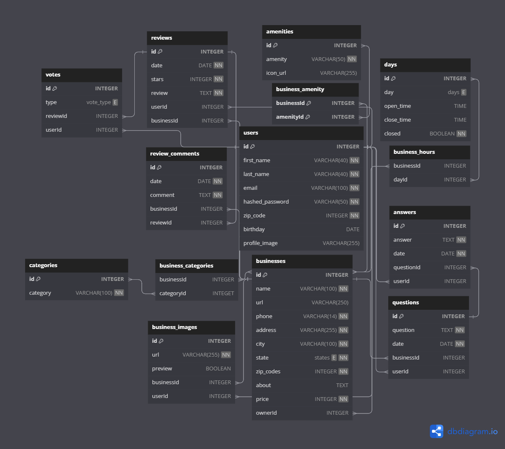

# **Database Schema**

## `users`

| column name   | data type    | details                               |
|---------------|--------------|---------------------------------------|
| id            | integer      | not null, primary key, auto increment |
| first_name    | varchar(40)  | not null                              |
| last_name     | varchar(40)  | not null                              |
| email         | varchar(100) | not null                              |
| password      | varchar(50)  | not null, unique                      |
| zip_code      | integer      | not null                              |
| birthday      | date         |                                       |
| profile_image | varchar(255) |                                       |

## `businesses`

| column name | data type    | details                                  |
|-------------|--------------|------------------------------------------|
| id          | integer      | not null, primary key, auto increment    |
| name        | varchar(100) | not null                                 |
| url         | varchar(250) |                                          |
| phone       | varchar(14)  | not null                                 |
| address     | varchar(255) | not null, unique                         |
| city        | varchar(100) | not null                                 |
| state       | enum         | [AL, AK, AZ, AR, CA, CO, CT, DE, FL, GA, HI, ID, IL, IN, IA, KS, KY, LA, ME, MD, MA, MI, MN, MS, MO, MT, NE, NV, NH, NJ, NM, NY, NC, ND, OH, OK, OR, PA, RI, SC, SD, TN, TX, UT, VT, VA, WA, WV, WI, WY], not null |
| zip_code    | integer      | not null                                 |
| about       | text         |                                          |
| price       | integer      | not null, default = 1                    |
| ownerId     | integer      | references: users.id                     |

## `business_images`

| column name | data type    | details                               |
|-------------|--------------|---------------------------------------|
| id          | integer      | not null, primary key, auto increment |
| url         | varchar(250) | not null                              |
| preview     | boolean      | not null, default = false             |
| businessId  | integer      | references: businesses.id             |
| userId      | integer      | references: users.id                  |

## `amenities`

| column name | data type   | details                               |
|-------------|-------------|---------------------------------------|
| id          | integer     | not null, primary key, auto increment |
| amenity     | varchar(50) | not null                              |

## `business_amenity`

| column name | data type | details                               |
|-------------|-----------|---------------------------------------|
| businessId  | integer   | references: businesses.id             |
| amenityId   | integer   | references: amenities.id              |

## `reviews`

| column name | data type | details                               |
|-------------|-----------|---------------------------------------|
| id          | integer   | not null, primary key, auto increment |
| date        | datetime  | not null, default: "CURRENT_DATE"     |
| stars       | integer   | not null, default = 1                 |
| review      | text      | not null,                             |
| userId      | integer   | references: users.id                  |
| businessId  | integer   | references: businesses.id             |

Indexes: (userId, businessId), unique

## `days`

| column name | data type | details                               |
|-------------|-----------|---------------------------------------|
| id          | integer   | not null, primary key, auto increment |
| day         | enum      | [Mon, Tue, Wed, Thu, Fri, Sat, Sun]   |
| open_time   | time      |                                       |
| close_time  | time      |                                       |
| closed      | boolean   | not null, default = false             |

## `business_hours`

| column name | data type | details                               |
|-------------|-----------|---------------------------------------|
| businessId  | integer   | references: businesses.id             |
| dayId       | integer   | references: days.id                   |

## `questions`

| column name | data type | details                               |
|-------------|-----------|---------------------------------------|
| id          | integer   | not null, primary key, auto increment |
| question    | text      | not null                              |
| date        | date      | not null, default = "CURRENT_DATE"    |
| businessId  | integer   | references: businesses.id             |
| userId      | integer   | references: users.id                  |

Indexes: (businessId, userId), unique

## `answers`

| column name | data type | details                               |
|-------------|-----------|---------------------------------------|
| id          | integer   | not null, primary key, auto increment |
| answer      | text      | not null                              |
| date        | date      | not null default = "CURRENT_DATE"     |
| questionId  | integer   | references: questions.id              |
| userId      | integer   | references: users.id                  |

Indexes: (questionId, userId), unique

## `votes`

| column name | data type | details                               |
|-------------|-----------|---------------------------------------|
| id          | integer   | not null, primary key, auto increment |
| type        | enum      | [Useful, Funny, Cool]                 |
| reviewId    | integer   | references: reviews.id                |
| userId      | integer   | references: users. id                 |

Indexes: (reviewId, userId) unique

## `review_comments`

| column name | data type | details                               |
|-------------|-----------|---------------------------------------|
| id          | integer   | not null, primary key, auto increment |
| comment     | text      | not null                              |
| businessId  | integer   | references: businesses.id             |
| reviewId    | integer   | references: reviews.id                |

Indexes: (businessId, reviewId), unique

## `categories`

| column name | data type    | details                               |
|-------------|--------------|---------------------------------------|
| id          | integer      | not null, primary key, auto increment |
| category    | varchar(100) | not null                              |

## `business_categories`

| column name | data type | details                               |
|-------------|-----------|---------------------------------------|
| businessId  | integer   | references: businesses.id             |
| categoryId  | integer   | references: categories.id             |
